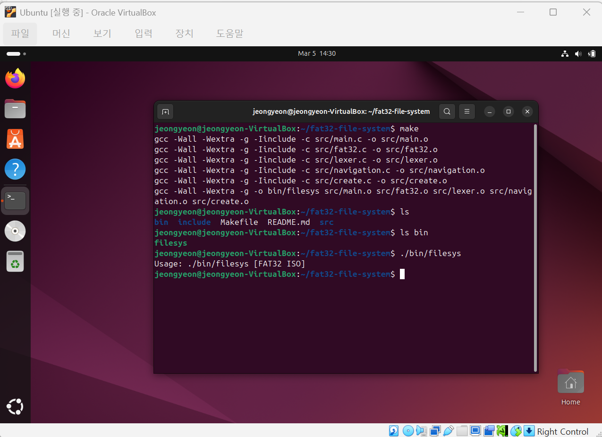

# FAT32 File System Implementation

Educational implementation of a FAT32 file system in C.
This project demonstrates how a file system manages directories, files, and disk structures such as clusters and FAT tables.

The system supports basic file system commands including navigation, file creation, reading, writing, and deletion.

Course: Operating Systems (COP4610) – Florida State University
Language: C
Environment: Linux / GCC

---

# Overview

This project implements a simplified FAT32 file system interface that operates on a disk image file.

The program parses the FAT32 boot sector and allows users to interact with the file system using shell-like commands.
Through this project, we explored internal FAT32 structures including:

* Boot sector metadata
* FAT tables
* Cluster chains
* Directory entries
* File allocation and navigation

---

# Features

* FAT32 boot sector parsing
* Directory navigation (`cd`, `ls`)
* File creation and directory creation
* File reading and writing
* File deletion
* Directory removal
* Cluster-based storage management
* Command-line file system interface

---

# Project Structure

```
fat32-file-system
│
├ include
│  ├ create.h
│  ├ fat32.h
│  ├ lexer.h
│  └ navigation.h
│
├ src
│  ├ create.c
│  ├ fat32.c
│  ├ lexer.c
│  ├ main.c
│  └ navigation.c
│
├ Makefile
└ README.md
```

---

# Build & Run

Requirements

* Linux environment
* GCC compiler

Compile the project:

```
make
```

Run the file system program with a FAT32 image:

```
./filesys <fat32_image_name.img>
```

---

# Example Usage

Example commands executed in the file system interface:

```
info
ls
cd documents
open test.txt
read test.txt 50
close test.txt
rm test.txt
mkdir new_folder
```

These commands allow navigation and manipulation of files stored within the FAT32 disk image.

---

## Build Example

Compilation and execution of the FAT32 file system project on Ubuntu.




# Team & Contribution

This project was developed as part of a team for the Operating Systems course.

Team Members

* Asia Thomas
* Cristian Prado
* Jeongyeon Kim

My Contributions (Jeongyeon Kim)

* Implemented image mounting and boot sector parsing
* Implemented `info` command
* Implemented `open` and `close` file operations
* Implemented file deletion (`rm`)
* Participated in testing and debugging file system behavior

---

# Notice

This project was originally developed as part of the Operating Systems course at Florida State University and is shared here for portfolio purposes.
